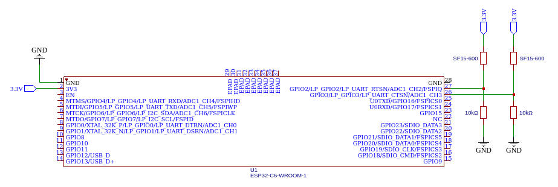
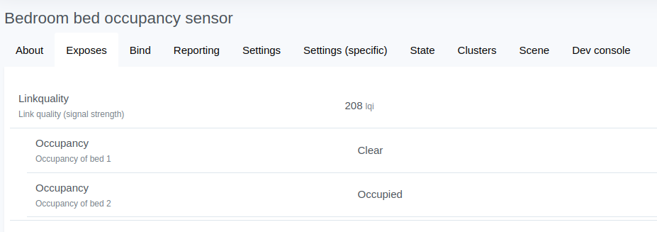

# Bed occupancy sensor with ESP32-C6

Handles bed occupancy on two sides of the bed using two SF15-600 pressure sensors.

Uses ADC channels 2 and 3 to read the voltage and decide whether that side of the bed is occupied.



## Zigbee2MQTT configuration

```js
const exposes = require('zigbee-herdsman-converters/lib/exposes');
const e = exposes.presets;
const utils = require('zigbee-herdsman-converters/lib/utils');

const definition = {
    zigbeeModel: ['Sleep'],
    model: 'Sleep',
    vendor: 'Chadi',
    description: 'Bed occupancy',
    fromZigbee: [{
        cluster: 'genBinaryInput',
        type: 'attributeReport',
        convert: (model, msg, publish, options, meta) => {
            return {[utils.postfixWithEndpointName('occupancy', msg, model, meta)]: msg.data.presentValue === 1 ? true : false};
        },
    }
    ],
    toZigbee: [],
    meta: {multiEndpoint: true},
    endpoint: (device) => {
        return {bed1: 10, bed2: 11};
    },
    exposes: [
        e.occupancy().withEndpoint('bed1').withDescription('Occupancy of bed 1'),
        e.occupancy().withEndpoint('bed2').withDescription('Occupancy of bed 2')
    ],
};

module.exports = definition;
```
Which shows up as this:



## Configure the project

Before project configuration and build, make sure to set the correct chip target
using `idf.py --preview set-target TARGET` command.

## Erase the NVRAM

Before flash it to the board, it is recommended to erase NVRAM if user doesn't want to keep the previous examples or
other projects stored info using `idf.py -p PORT erase-flash`

## Build and Flash

Build the project, flash it to the board, and start the monitor tool to view the serial output by
running `idf.py -p PORT flash monitor`.

(To exit the serial monitor, type ``Ctrl-]``.)
